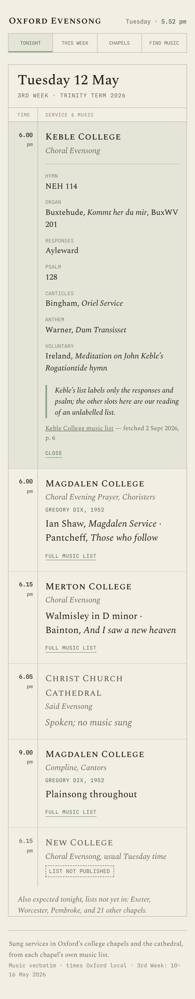
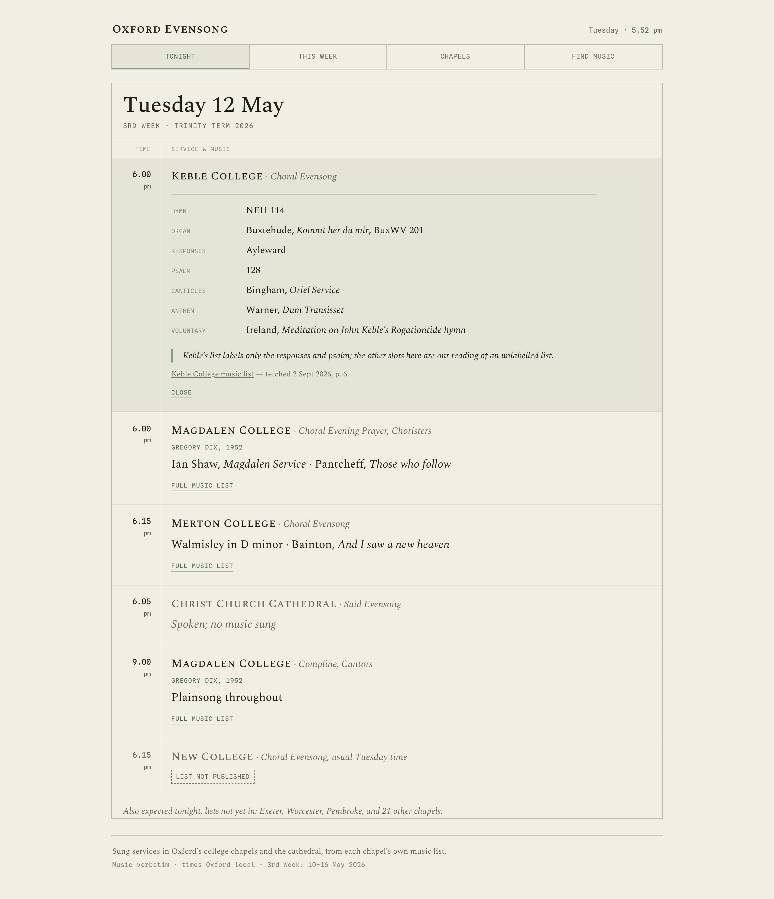

# Design direction — chosen: H2 (*Register*)

After A → D/E/F → G/H/I → H1/H2/H3, the chosen direction is **H2**.
Mock: [`design/direction-h2.html`](../design/direction-h2.html) (the Tonight view,
rendered against the `2026-TT` fixture). Screenshots:
[`h2-390`](../design/screens/h2-390.png) · [`h2-1280`](../design/screens/h2-1280.png).

**Not final** — palette, fonts and border weights may still be adjusted. The proper
`docs/design-brief.md` will be written from this before any site HTML is committed.

 &nbsp; 

---

## H2 as it stands

An **order of service crossed with a printed register**. Serif body with small
caps; monospace for the scaffolding; the whole dated feed inside one bounded
rectangle with a `TIME | SERVICE & MUSIC` column header; a warm-paper ground and a
single sage-green accent. Light mode only.

### Layout

- **Top bar** — `Oxford Evensong` in Spectral SC (1.16 rem), a mono clock right, a
  hairline under. No reversed block.
- **Nav** — a fully enclosed strip of four ruled cells; the active cell has a faint
  sage tint and a sage underline.
- **The board** — one 1 px `--rule` rectangle containing everything below:
  - **Date band** — `Tuesday 12 May` in Spectral (2.3 rem), the week in mono caps,
    a `--rule` border under.
  - **Column header** — `TIME | SERVICE & MUSIC` in tiny mono caps, `--rule` under;
    the time/body split reads as real columns (`--rule`, not hairline).
  - **Entries** — mono time (+ small `pm`) in the gutter with a `--rule` vertical
    divider; chapel in Spectral SC small caps; kind in italic after a middot;
    occasion in sage mono caps; a one-line summary, or when open a `slot → value`
    grid (mono labels, serif values) with a `--rule` top border, then a sage
    left-bar flag in italic and a quiet source line. An **open entry gets a faint
    sage tint** across the whole row. `FULL MUSIC LIST` / `CLOSE` are small sage
    underlined links.
  - **Said** service: greyed, "Spoken; no music sung". **List not published**: a
    dashed mono tag.
- **Footer** — a sentence in the serif over a mono colophon line, a `--rule` above.
- Centred, **~57 rem**; the bounded board makes the desktop margins read as a mat.

### Typefaces

| Role | Face | Notes |
|---|---|---|
| Body, chapel names, date, masthead | **Spectral** + **Spectral SC** (Production Type / OFL) | Spectral SC is a *real* small-caps family, not synthesised. |
| Time, nav, slot labels, week line, occasion, tags | **Spline Sans Mono** (OFL) | Clean, even, neutral — tabular by construction. |

Self-host the woff2 for the real site (no runtime dependency; works under the Pages
sub-path).

### Palette

| Token | Hex | Use |
|---|---|---|
| Paper | `#F1EEE3` | page ground (warm) |
| Ink | `#22201A` | text |
| Mid | `#6C685C` | kind, said/ghost rows, footer |
| Faint | `#8A8474` | slot labels, column header (~3.3 : 1 — nudge darker if it must clear 4.5) |
| Hairline | `#D8D3C4` | entry dividers |
| Rule | `#C3BDAB` | board frame, column rule, header rule, date rule, footer rule |
| **Sage** | `#83A07E` | accent — left-bars, nav underline, open-row tint base |
| **Sage (text)** | `#4F6B4C` | occasion, disclosure links, clock highlight |
| Open-row tint | `rgba(131,160,126,.12)` | background of an expanded entry |

---

## Alternatives on the table (from H1 / H3, kept for the brief session)

The structure is fixed; these are drop-in swaps if the sage/Spectral combination
doesn't hold up.

**Palette — cool (was H1):** paper `#EEEEEA`, ink `#232631`, rule `#BFBFB6`, accent
dusty blue `#6E88A0` / text `#4E657C`.

**Palette — warm rose (was H3):** paper `#F0ECE3`, ink `#241F1B`, rule `#C6BDAB`,
accent dusty rose `#BE9084` / text `#8A564B`.

**Fonts — H1 pairing:** Source Serif 4 (has small caps) + IBM Plex Mono.
**Fonts — H3 pairing:** Newsreader (has small caps) + DM Mono (lighter than Plex).

**Border character:** H3 also firmed the page edges — a 2 px rule closing the
masthead and another above the footer — if H2 wants a more defined top/bottom.

---

## Still to settle (for `docs/design-brief.md`, together)

- Final palette + type + border weights (the above).
- How **This Week**, **Chapels** and **Find music** sit on the same furniture.
- **Day selection** (required): the date band is a control — `‹ prev / next ›`
  plus a picker over the term's weeks (`scripts/oxweeks.mjs` already does the
  arithmetic). "Tonight"/"Today" is this view defaulted to today; each day in
  **This Week** links into it; a day with nothing sung shows "Nothing sung on
  «date»". No data/schema change — the site filters `services[]` by the chosen
  date. Open: keep the nav label "Tonight" (date band carries navigation) or
  rename to "Today".
- How "nothing on tonight" reads.
- `confidence: "low"` vs `"medium"` wording; how "list not yet published" reads for
  a whole venue vs a single service.
- Whether the desktop board grows a right-hand rail (week strip) or stays centred.

## What every mock showed

Tuesday 12 May 2026, 3rd Week, from `data/terms/2026-TT.json`: Keble expanded
(7-line list, interpreted slots flagged), Magdalen with an occasion, Merton plain,
Christ Church **said**, Magdalen Compline (sparse), New College **list not
published**. The said row and the unpublished row are synthesised to the schema's
shape (the fixture has neither); music text is verbatim; slots shown as printed
where a list labels them, flagged as *our reading* where it doesn't.
